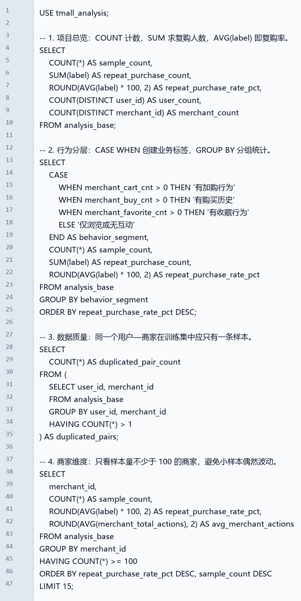

# 天猫用户复购预测与用户增长分析

面向产品数据分析岗位的端到端个人实战项目：从 5,492 万条用户行为日志中构建用户—商家特征，使用 MySQL 完成业务诊断，对比逻辑回归与随机森林，并输出可用于 Power BI 的用户增长运营看板数据。

## 业务问题

大促后商家面临复购率低、全量触达成本高的问题。本项目以“识别高潜复购用户并支持差异化触达”为目标，按用户—商家粒度输出复购排序得分和运营人群。

## 实际运行结果

以下指标均由本地代码实际运行得到；验证集采用 80/20 分层切分。

| 指标 | 逻辑回归（最终模型） | 随机森林（对比模型） |
| --- | ---: | ---: |
| ROC-AUC | **0.6127** | 0.5813 |
| PR-AUC | **0.1033** | 0.0896 |
| Top20% 用户复购率 | **10.61%** | 9.47% |
| Recall@Top20% | **34.70%** | 30.97% |
| Lift@Top20% | **1.74** | 1.55 |

逻辑回归相对随机森林的 AUC 差值 95% 配对自助法置信区间为 **[0.0220, 0.0403]**，因此选择逻辑回归作为当前复购排序模型。

> 模型输出用于用户排序和分层。由于训练时使用类别权重，得分不表述为严格校准的真实复购概率；真实线上增量仍须通过 A/B 测试验证。

## 项目流程

```text
业务痛点 → 数据质量校验 / SQL 诊断 → 特征构建 → 模型对比与评估
       → 高潜用户分层 → Power BI 运营看板 → A/B 测试验证设计
```

## 主要产出

- **数据诊断**：260,864 条训练样本、212,062 名用户、1,993 个商家；用户—商家组合重复数为 0。
- **MySQL 分析**：建表、导入、`CASE WHEN` 行为分层、`GROUP BY` 聚合、`HAVING` 小样本过滤、商家榜单。
- **科学评估**：逻辑回归与随机森林公平比较；ROC-AUC、PR-AUC、Recall@Top20%、Lift@Top20% 和自助法置信区间。
- **运营策略**：测试集中形成 51,730 名高潜老客、566 名高潜加购用户及低潜人群的差异化触达建议。
- **Power BI**：提供可导入的聚合数据、DAX 度量值、页面布局和真实数据预览图。

## Power BI：用户复购增长运营看板

看板聚焦“模型效果、高潜用户规模、用户分层、行为阶段复购率、模型对比、商家榜单”六类信息。


- [Power BI 搭建说明](dashboard/POWER_BI_GUIDE.md)
- [DAX 度量值](dashboard/DAX_MEASURES.md)
- [`dashboard/data/`](dashboard/data/)：可直接导入的聚合数据

## MySQL SQL 代码示例

下图由项目中的真实 MySQL 查询文件渲染，包含项目总览、行为分层、数据质量和商家分析 SQL。



- [建库建表 SQL](advanced/mysql/00_create_schema.sql)
- [业务分析 SQL](advanced/mysql/01_business_analysis_mysql.sql)
- [SQL 分析代码](advanced/01_sql_business_analysis.py)

## 运行方式

首次运行基础管道会分块处理约 1.9GB 行为日志并缓存特征：

```cmd
python tmall_repurchase_project\src\run_pipeline.py
```

运行进阶版最终模型、策略和 Power BI 数据：

```cmd
python tmall_repurchase_project\advanced\03_final_logistic_strategy.py
```

运行模型对比与自助法评估：

```cmd
python tmall_repurchase_project\advanced\02_model_comparison.py
```

## 数据说明

- `train_format1.csv`：用户—商家训练标签；`label=1` 表示复购。
- `test_format1.csv`：待排序的用户—商家组合。
- `user_log_format1.csv`：行为明细；`0=浏览`、`1=加购`、`2=购买`、`3=收藏`。
- `user_info_format1.csv`：用户年龄段和性别。

原始数据、用户级预测名单、特征缓存和数据库文件均不上传仓库。

## 项目结构

详见 [项目结构说明](docs/PROJECT_STRUCTURE.md)。

```text
tmall_repurchase_project/
├── src/                       # 基础管道
├── advanced/                  # SQL、模型对比、最终策略
├── dashboard/                 # Power BI 数据、DAX 与说明
├── docs/                      # 项目结构与代码截图
├── outputs/                   # 可展示图表、指标和报告
└── requirements.txt
```
