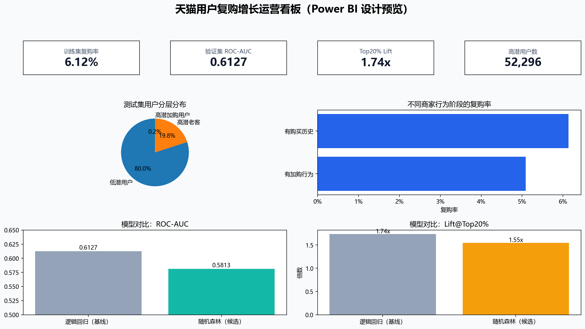

# Power BI：天猫用户复购增长运营看板（MySQL 真实数据链路）

## 1. 真实业务链路

```text
天猫原始数据 → Python 分块处理/特征工程 → MySQL 分析表与策略表
          → MySQL 业务视图（数据集市） → Power BI 建模/DAX → 运营看板 → A/B 测试
```

Power BI 不导入图片，也不把预览图当数据源；它直接读取本机 MySQL 中的表和视图。这样当策略表或分析表更新后，只需在 Power BI 点击“刷新”即可同步指标。

## 2. 先在 Navicat 完成数据集市

已存在的表：`analysis_base`，包含 260,864 条带标签的用户—商家训练样本与 23 项特征。

按顺序执行：

1. 执行 [`02_create_growth_strategy_table.sql`](../sql/02_create_growth_strategy_table.sql)，创建 `growth_strategy`。
2. 用 Navicat 的“导入向导”，将本地文件 `data/mysql_import/growth_strategy_mysql.csv` 导入 `growth_strategy` 表。该文件共有 **261,477** 条测试集用户—商家策略记录。
3. 执行 [`03_create_dashboard_mart.sql`](../sql/03_create_dashboard_mart.sql)，创建模型评估表和 4 个业务视图。

执行后，在 `tmall_analysis` 库中应看到：

| 对象 | 作用 |
| --- | --- |
| `analysis_base` | 训练样本与行为特征明细 |
| `growth_strategy` | 测试集复购得分、用户分层、推荐动作 |
| `model_evaluation` | 逻辑回归与随机森林的真实离线指标 |
| `v_behavior_repurchase` | 不同行为阶段的复购表现 |
| `v_demographic_repurchase` | 年龄段、性别复购表现 |
| `v_merchant_repurchase` | 商家复购率与互动强度 |
| `v_growth_segment` | 高潜/低潜人群及建议动作 |

## 3. Power BI 连接 MySQL

1. 打开 Power BI Desktop，点击“获取数据 → MySQL 数据库”。
2. 服务器填写 `127.0.0.1:3306`，数据库填写 `tmall_analysis`。
3. 输入你本机的 MySQL 用户名和密码；数据连接模式选择“导入”。
4. 在导航器中勾选以下 5 项并加载：

```text
model_evaluation
v_behavior_repurchase
v_demographic_repurchase
v_merchant_repurchase
v_growth_segment
```

如果 Power BI 提示缺少 MySQL Connector/NET，按弹窗安装后重启 Power BI；这是 Power BI 连接 MySQL 的驱动，不是项目数据。

## 4. 看板页面：用户复购增长运营看板

建议只做一页，围绕运营决策展示：

| 位置 | 视觉对象 | 数据源与字段 | 业务问题 |
| --- | --- | --- | --- |
| 顶部 | 4 张卡片 | 最终模型 AUC、Top20% Lift、整体复购率、高潜用户数 | 模型有没有价值、触达规模多大？ |
| 第二行左侧 | 圆环图 | `v_growth_segment`：`user_segment`、`user_count` | 高潜用户有哪些？ |
| 第二行中左 | 簇状柱形图 | `v_behavior_repurchase`：`behavior_segment`、`repeat_purchase_rate` | 不同行为阶段的复购率是否存在差异？ |
| 第二行中右 | 簇状柱形图 | `model_evaluation`：`model_name`、`roc_auc` | 为什么最终选择逻辑回归？ |
| 第二行右侧 | 表格 | `v_growth_segment`：`user_segment`、`recommended_action`、`user_count` | 每类用户应采取什么运营动作？ |

已完成的看板文件为 [`天猫用户复购增长运营看板.pbix`](%E5%A4%A9%E7%8C%AB%E7%94%A8%E6%88%B7%E5%A4%8D%E8%B4%AD%E5%A2%9E%E9%95%BF%E8%BF%90%E8%90%A5%E7%9C%8B%E6%9D%BF.pbix)，其数据源为本地 MySQL 业务视图；打开后可在 Power BI Desktop 中刷新数据。

## 5. 结果解释边界

- `repeat_purchase_score` 用于排序和分层；训练时使用类别权重，因此不表述为严格校准的真实复购概率。
- Top20% Lift=1.74 表示优先触达高分前 20% 用户时，离线复购密度约为总体的 1.74 倍。
- 看板展示离线分析结果；真实增长效果必须以随机分流后的 A/B 测试为准。

## 6. 设计预览



`dashboard/data/` 保留的是可公开查看的聚合数据副本，便于 GitHub 阅读；正式 Power BI 看板应按本说明连接 MySQL 视图。
